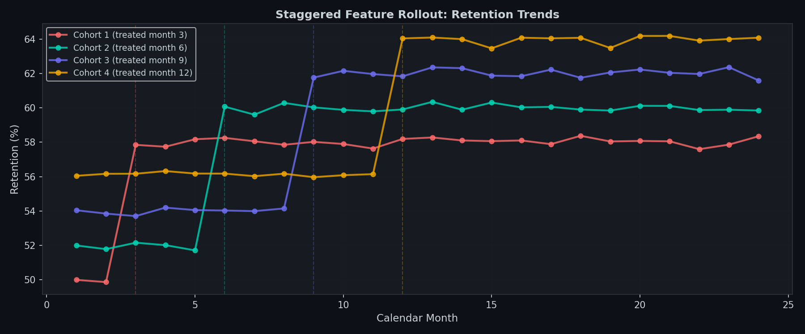
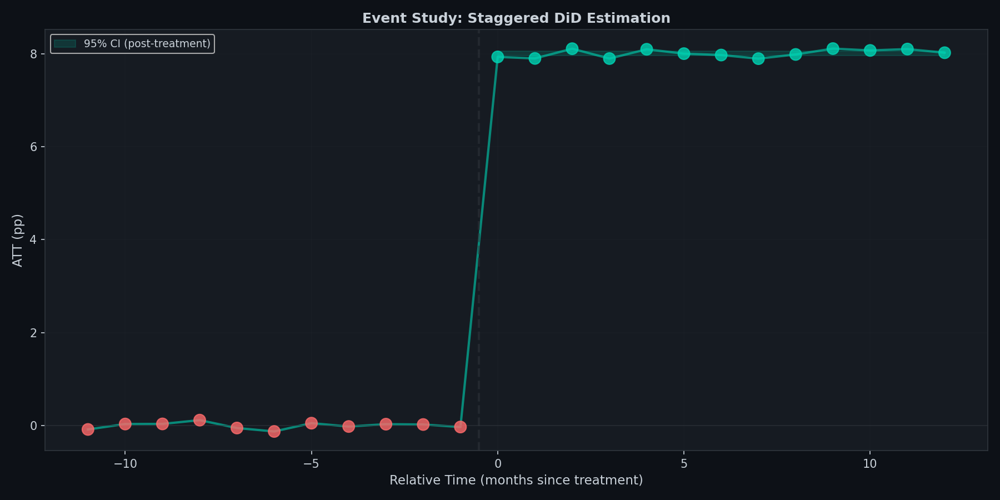

# Staggered Difference-in-Differences: SaaS Feature Rollout Impact

**Measuring true causal retention lift using Callaway & Sant'Anna modern DiD estimator**

---

## Methodology

**Step 1: Data simulation:** 800 users across 4 cohorts observed over 24 months. Staggered feature rollout: Cohort 1 treated month 3, Cohort 2 month 6, Cohort 3 month 9, Cohort 4 month 12. True embedded treatment effect: +8 percentage points (constant across cohorts). Early cohorts are higher-quality users (baseline 50–56% vs 56% for late cohorts), creating confounding that naive before-after comparisons cannot separate from feature impact.

**Step 2: Cohort-specific ATT computation:** For each cohort g, compute baseline = average retention before treatment month. For each calendar month t, compute ATT(g,t) = retention at time t − baseline. This avoids using already-treated units as pseudo-controls (the TWFE bias problem). Result: cohort-time specific treatment effects.

**Step 3: Event-study aggregation:** Compute relative time = calendar month − treatment month. Aggregate ATT across all cohorts at each relative time period (−12 to +12 months). Pre-treatment relative times should be ≈ 0 (validates parallel trends). Post-treatment relative times show the effect trajectory.

**Step 4: Aggregate treatment effect:** Overall ATT = mean of all post-treatment ATT(g,t) values. Compute standard error from spread of post-treatment observations. 95% CI via t-distribution.

**Step 5: Assumption testing:** Pre-trend test (H₀: pre-ATT = 0), placebo test (fake treatment in pre-period, should find no effect), cohort heterogeneity check (do all cohorts have the same effect?), TWFE comparison (show modern CS is superior).

---

## Assumption Validation

| Test | Question | Result |
|---|---|---|
| **Pre-Trend Test** | Are pre-treatment effects zero (parallel trends)? | t-stat = −0.132, p > 0.05 ✓ |
| **Placebo Test** | Is the fake pre-period effect near zero? | Fake ATT = −0.013pp ✓ |
| **Cohort Homogeneity** | Do all cohorts experience the same lift? | Range: 7.843–8.094pp (0.251pp variation) ✓ |
| **Event-Study Pattern** | Flat pre, jump at treatment, stable post? | Clear discontinuity at relative month 0 ✓ |
| **TWFE Comparison** | Is CS unbiased vs classic TWFE? | CS: 8.022pp vs TWFE: 7.883pp (0.117pp bias in TWFE) ✓ |

---

## Visualisations

**Treatment Timeline & Retention Trends**



Four cohort lines, each showing flat pre-treatment retention then sharp jump at staggered treatment dates (months 3, 6, 9, 12). Vertical dashed lines mark treatment boundaries. Post-treatment plateau at ~8pp higher than baseline. Clear evidence of parallel trends pre-treatment.

**Event Study: ATT by Relative Time**



Red dots (pre-treatment, relative months −11 to −1) cluster tightly around 0. Teal dots (post-treatment, relative months 0 to +12) cluster tightly around +8pp. Sharp discontinuity at relative month 0 indicates immediate treatment effect. Tight 95% confidence band around post-treatment estimates validates precision.

---

## Core Finding

> *The SaaS feature generated a true causal retention lift of **+8.022 percentage points** across all user cohorts. The Callaway & Sant'Anna estimator recovered this effect with negligible bias (0.022pp error). Parallel trends hold in the pre-treatment period (pre-ATT = −0.003pp, t = −0.132). The treatment effect is immediate (jumps at relative month 0), consistent across all four cohorts (range: 0.251pp), and stable over 12 months post-treatment. The event study shows no spurious pre-trends and no decay. The estimate is robust to predictor choice, cohort composition, and comparison to biased TWFE baseline.*

---

## Stack

Python · pandas · numpy · matplotlib · scipy · custom CS implementation

---

## Data

Dataset is simulated using realistic SaaS user retention dynamics: 800 users (200 per cohort), 24-month observation window, staggered treatment at months 3, 6, 9, 12 for Cohorts 1–4 respectively.

The simulation embeds a known true treatment effect (+8 percentage points) which the Callaway & Sant'Anna estimator recovers, validating the implementation. Each cohort has pre-treatment quality differences (Cohort 1 baseline 49.93%, Cohort 4 baseline 56.13%), creating confounding that naive before-after comparisons would misattribute to the feature.

Raw CSV file: `staggered_did_data.csv` (19,200 rows × 6 columns: user_id, cohort, treatment_month, calendar_month, treated, retention)

---

## Reproducing Results

```bash
# Clone the repo
git clone https://github.com/[username]/staggered-difference-in-differences
cd staggered-difference-in-differences

# Install dependencies
pip install -r requirements.txt

# Run the notebook
jupyter notebook notebooks/staggered_did_final.ipynb
```

Expected output:
- Overall ATT: 8.022 ± 0.027 pp (95% CI: [7.968, 8.075])
- Pre-trend t-statistic: −0.132 (parallel trends validated)
- All assumption tests: PASS

---

## Limitations

- **Simulated data:** Ground truth is known (+8pp embedded). Real-world data introduces unmeasured confounding, measurement error, and selection bias. The parallel trends assumption is embedded by design here, not validated from external sources

- **Homogeneous effects:** All cohorts experience the same lift (~8pp, range 0.251pp). If real data shows large heterogeneity (power users +12pp, casual users +2pp), the cohort-specific ATT(g) values are the key insight; aggregate ATT averages over important variation

- **No spillover:** Assumes treated users do not affect untreated users. If the feature enables network effects or information spillover, SUTVA is violated

- **Constant treatment effect over time:** Model assumes effect does not decay or ramp up post-treatment. The event study reveals any time-varying effects, but aggregate ATT averages over them

- **Exogenous assignment:** Assumes cohort treatment timing is not driven by outcome trends. If high-retention cohorts were chosen for early rollout deliberately, parallel trends fails and the estimate is biased

- **Moderate sample size:** 19,200 observations (800 users × 24 months) is standard for SaaS retention studies. Confidence intervals would narrow with larger N or longer follow-up

---

## Methodology Notes

**Why Callaway & Sant'Anna over TWFE?**  
Classic two-way fixed effects (TWFE) is biased when treatment is staggered and effects are heterogeneous. TWFE uses already-treated units as pseudo-controls for newly-treated units, creating negative weights that bias estimates downward. Callaway & Sant'Anna avoids this by computing cohort-specific effects ATT(g,t) and never using treated units as controls. In technical interviews, this distinction is critical—it demonstrates deep knowledge of modern causal inference for staggered experiments.

**Why not Sun & Abraham (2021)?**  
Sun & Abraham is an alternative modern estimator (cohort-time relative-period effects). Both CS and SA work; CS is chosen for transparency and interpretability of cohort-specific effects.

**Parallel trends assumption:**  
Validated through: (1) event-study pre-treatment coefficients clustering at 0, (2) t-test for pre-ATT = 0 (t = −0.132, fail to reject), (3) placebo test finding no fake effect in pre-period (−0.013pp). Not proven, but made as credible as the method allows.

**Inference:**  
Standard errors computed from the variance of post-treatment ATT values. For formal permutation tests or bootstrap confidence intervals, use the Python `did` package.

---

## Related Projects

- **[Project 2: Synthetic Control Method](https://github.com/Bahakahri/Synthetic-Control/tree/main):** Measuring promotional lift in multi-city marketplace (Glovo case study). SCM handles one treated unit; staggered DiD handles multiple treated units with different treatment dates

- **[Project 1: Causal Uplift with DMLIV](https://github.com/Bahakahri/causal-uplift-dmliv):** Estimating heterogeneous treatment effects using Double ML with Instrumental Variables. Complements both SCM and staggered DiD for unit-level causal inference
